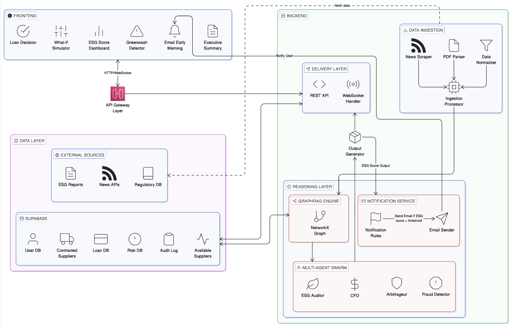

# GreenTrust Pulse — AI-Powered ESG Intelligence Engine for SMEs

GreenTrust Pulse is a high-fidelity ESG intelligence platform built to help Malaysian SMEs navigate sustainability risks, detect greenwashing, and unlock premium green financing (SLL). Using a multi-agent swarm architecture and GraphRAG, it transforms raw supply chain data into actionable financial resilience.

---

# 10-Minute Pitching Video with Prototype Demonstration
Youtube: https://youtu.be/2dLa_F3zq6s

Drive: https://drive.google.com/file/d/1eAGAw8gUz3u4LcbI_XuAdSmaBWxvWx2H/view?usp=sharing

[Pitching Video with Prototype Demonstration](Presentation%20Video/121_TriforceTech_PitchingVideowithPrototypeDemonstration.mp4)

# Documentation

| Document | Description |
|----------|-------------|
| [Product Requirement Document](Documentation/121_TriforceTech_ProductRequirementDocument.pdf) | Functional & non-functional requirements |
| [System Analysis Document](Documentation/121_TriforceTech_SystemAnalysisDocument.pdf) | Architecture, data flows & system design |
| [Quality Assurance & Testing Document](Documentation/121_TriforceTech_QualityAssuranceTestingDocument.pdf) | Test plans, cases & QA methodology |
| [Preliminary Round Pitch Deck](Documentation/121_TriforceTech_PreliminaryRoundPresentationPitchDeck.pdf) | Presentation slides for preliminary round |

---

> **Mission:** To empower SMEs with high-fidelity ESG intelligence, enabling them to navigate sustainability risks and unlock green financing with AI-driven precision.
>
> **Vision:** A resilient Malaysian business ecosystem where transparent ESG data drives financial value and sustainable growth for every SME.

---

# Overview
GreenTrust Pulse is an AI-powered intelligence engine that monitors, analyzes, and optimizes ESG performance for SMEs and their supply chains.



## It helps Malaysian SMEs contribute to:
- **Green Financing Access**: Converts fragmented data into banker-ready profiles for the 92% of SMEs that don’t qualify.
- **National Decarbonization**: Encourages use of LCTF for renewable energy and efficiency upgrades.
- **Supply Chain Resilience**: Provides verified ESG proof to retain MNC contracts.
- **Digital Financial Inclusion**: Builds a trusted ESG score as a financial asset.
- **Operational Intelligence**: Uses AI for real-time risk detection and data-driven decisions.
- **Cost Efficiency**: Replaces costly ESG consulting with an automated platform.

## GreenTrust Pulse blends:
- **Z.AI GLM-4 + GraphRAG**: Bilingual (Bahasa Malaysia & English) reasoning for local context.
- **Multi-Agent Swarm Intelligence**: 4 specialized AI agents debating business pivots.
- **Supply Chain Knowledge Graphs**: Visualizing risk propagation and ripple impacts.
- **Financial ROI Calculation**: Mapping ESG scores directly to interest rate savings (RM).

---

# The "Pivot" Flow
## How it works:
- **Early Risk Detection**: AI scrapers detect a supplier violation (e.g., illegal dumping in BM news).
- **Agent Swarm Debate**: Four agents (Fraud, Auditor, CFO, Arbitrageur) evaluate the risk vs. cost of switching.
- **Verdict & Strategy**: The system calculates the RM impact of staying vs. pivoting.
- **Execute Pivot**: One-click action to switch to a certified sustainable supplier.
- **Real-time Impact**: SME preserves Tier 1 Green Loan status, saving thousands in annual interest.

### ESG Intelligence Components
- **Greenwash Risk Detector**: Cross-references EN ESG claims against BM news headlines to flag contradictions.
- **What-If ESG Simulator**: Interactive sliders to model how investments in energy/waste affect loan approval probability.
- **Impact Forecast Timeline**: 30/60/90-day projection of recovery after a risk event.
- **Loan Decision Card**: Precise financing recommendations from banks like Ant International.

---

# Features

1. **Banker-Ready ESG Profile**
   Delivers a GraphRAG-driven score and automated eligibility checks for green loans, acting as a virtual loan officer.

2. **Integrity Guard & Fraud Detection**
   Ensures trust by monitoring data consistency to detect greenwashing and providing transparent reasoning traces.

3. **Predictive Strategy & Simulation**
   Features "what-if" simulations to forecast financial impacts and model strategies for securing long-term MNC contracts.

4. **Real-Time Compliance Pulse**
   Provides instant alerts on ESG risks and deadlines alongside AI-generated executive summaries for rapid reporting.

---

# Backend Methodology

### 1. Data & Ingestion (Supabase)
**Ingests:**
- SME Profiles & ESG self-reports
- Real-time News API (Google News)
- Regulatory Rules DB (Malaysia EQA 1974)
- Supplier relationship data

### 2. Reasoning Layer (GLM Swarm)
| Agent | Role | Capability |
|-------|------|------------|
| **Agent 4 (Fraud Detector)** | Greenwash Detection | Cross-lingual verification (BM/EN) |
| **Agent 1 (ESG Auditor)** | Scoring & Auditing | Long-context doc reasoning (GraphRAG) |
| **Agent 2 (CFO)** | Financial Critique | CoT arithmetic for RM impact |
| **Agent 3 (Arbitrageur)** | Final Arbitrage | Synthesis of ESG risk vs. Financial ROI |

### 3. Graph Engine (NetworkX)
**Performs:**
- Node relationship mapping (SME → Supplier)
- Risk propagation scoring
- Visual supply chain generation for the frontend

### 4. Simulation Engine (What-If)
**Provides:**
- Real-time recalculation of loan approval probability based on user-defined ESG improvements.

---

# Tech Stack

### Frontend
- **Next.js 14 (App Router)**
- **TypeScript**
- **Tailwind CSS v3**
- **Framer Motion v11** (Animations)
- **React Flow** (Supply chain graphs)
- **Recharts** (ESG charts)
- **Zustand** (State management)

### Backend
- **Python FastAPI**
- **Z.AI GLM-4-Plus** (LLM)
- **LangChain** (Orchestration)
- **NetworkX** (Knowledge Graph)
- **Supabase** (Database)
- **Socket.io** (Real-time events)

---

# Folder Structure
```
green-graphswarm/
├── Frontend/                 # Next.js 14 Web App
│   ├── app/                  # App Router: Dashboard, Scenarios, What-If
│   ├── components/           # UI, Dashboard, & Graph components
│   ├── store/                # Zustand global state
│   ├── hooks/                # WebSocket & Simulation hooks
│   └── public/               # Static assets (Architecture & Logos)
├── Backend/                  # Python FastAPI Server
│   ├── agents/               # 4-Agent GLM Swarm logic
│   ├── core/                 # Ingestion, Graph, Risk, & Loan engines
│   ├── database/             # Supabase client & schemas
│   └── tests/                # System scenarios logic
├── public/                   # Root assets
└── README.md
```

---

# Getting Started

## Virtual Environment (Backend)
```bash
cd Backend
python3.13 -m venv venv
source venv/bin/activate
pip install -r requirements.txt
python -m uvicorn main:app --reload
```

## Frontend
```bash
cd Frontend
npm install
npm run dev
```

---

# Design System
- **Theme**: High-Tech Dark Mode (`#0A0F1E`)
- **Primary Color**: ESG Green (`#00C896`)
- **Alert Color**: Risk Red (`#FF4444`)
- **Typography**: Inter (UI), JetBrains Mono (Financials)
- **Style**: Glassmorphism, card-based layouts, pulsing live indicators.

###### **Smart ESG. Real Business Result.** 
###### **GreenTrust Pulse: The Intelligence Engine for a Sustainable Future.**
